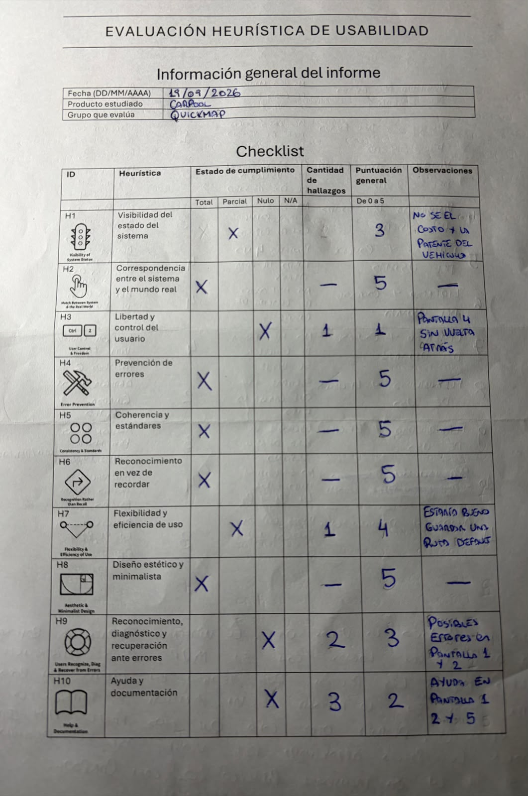
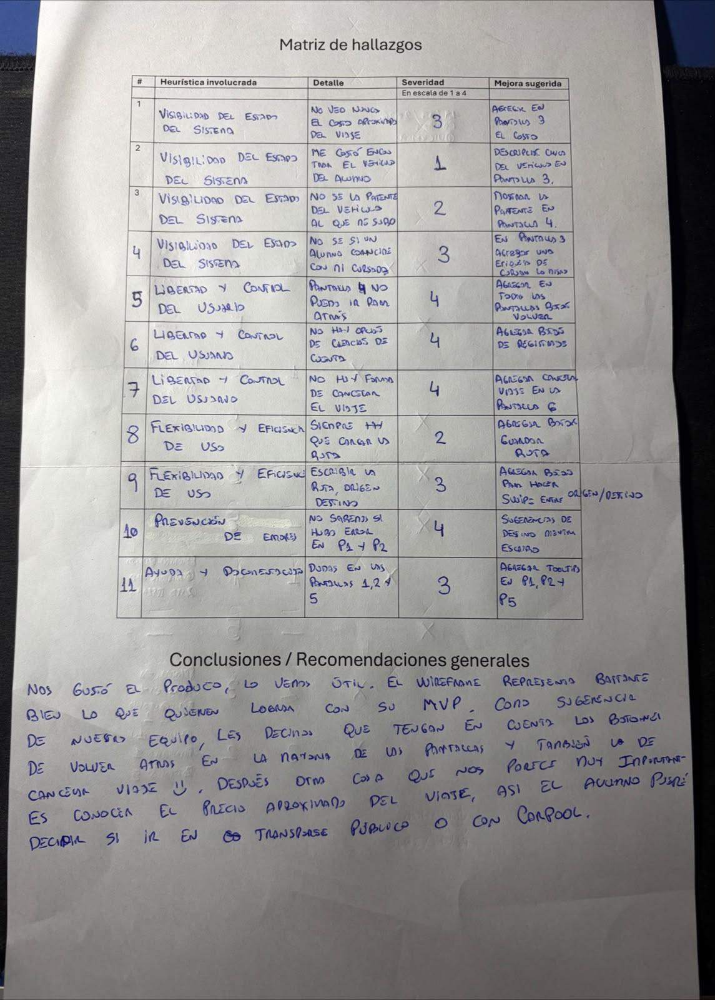

# Vertex - Evaluacion
## 1. Antes de mirar el Wireframe
- Quien es el usuario?
Un alumno que cursa de noche, que vive a mas de 5km de la UNLaM y tiene utilizar el transporte publico.
- En que contexto lo usa?
El alumno por finalizar la cursada toma su celular para validar si hay algun alumno que quiera compartir el viaje hasta su destino.
- Que atributos de usabilidad priorizó?
    - Eficiencia
        Busqueda de viajes con similar destino en un mismo horario
    - Satisfacción
        Seguridad y confianza al elegir con quien compartir viaje
- Cual es la hipotesis?
Existen alumnos de UNLaM que cursan presencial de noche, que tienen que ir y volver en transporte publico y sufren demoras al esperar que llegue el transporte publico, que tenga lugar (porque es horario pico) y tambien el tema de la inseguridad al volver de noche. La hipótesis es que estos alumnos estarían dispuestos a volver con otros alumnos que viajan cerca de su destino original en auto, a cambio de compartir los costos del viaje.

## 2. Evaluación heuristica - la del equipo
| # | Heurística incumplida | Descripción del problema | Severidad (1-4) | Mejora sugerida |
|---|---|---|---|---|
| 1 | Visibilidad del estado del sistema | No veo nunca el costo aproximado del viaje | 3 | Agregar en la pantalla 3 un costo aproximado de viajar con ese alumno |
| 1 | Visibilidad del estado del sistema | Me costo encontrar el vehiculo del alumno | 1 | Agregar una descripción del vehiculo en la pantalla 3, para que el alumno pueda elegir que vehiculo prefiere antes de ver el perfil completo del conductor. |
| 1 | Visibilidad del estado del sistema | No se la patente del vehiculo al que me voy a subir | 2 | Puede pasar que otra persona tenga el mismo vehiculo, mismo color y se haga pasar por alumno de la UNLaM; mostrando la patente del vehiculo mitigas un poco ese problema. |
| 3 | Libertad y control del usuario | Después de seleccionar al conductor en la pantalla 3, no puedo ir para atrás. | 4 | Agregar en todas las pantallas un botón de Volver, o una flechita arriba a la derecha para entender que puedo volver al paso anterior. |
| 7 | Flexibilidad y eficiencia de uso | Normalmente los alumnos suelen viajar siempre desde el mismo lugar hacia el mismo lugar, y sin embargo siempre tienen que cargar la misma ruta cada vez que quieren buscar un viaje. | 2 | Tener un boton de "Recordar ruta" o algo similar en la pantalla 2 |
| 9 | Reconocimiento, diagnostico y recuperación ante errores | El usuario no tiene forma de saber si hubo un error en el Login y en la Pantalla 2 al buscar un viaje tambien, si sucede un error no tiene forma de saberlo. | 4 | Agregar un link de "Olvidaste tu contraseña" en la pantalla 1, y en la pantalla 2 me gustaria que me salgan sugerencias de destintos a medida que voy escribiendo. Ejempo, escribo "Pad" y que ya me salga para seleccionar "Padua" |
| 10 | Ayuda y documentación | Como usuario si alguna de las pantallas decisivas 1, 2 y 5 tengo dudas sobre lo que estoy haciendo, no tengo información para entender que esta pasando en cada pantalla. | 3 | Agregar un icono de ayuda o de información en las pantallas 1, 2 y 5 describiendo que se esta haciendo en cada una y que se espera del usuario. |

## 3. Evaluación heurística de la IA
| # | Heurística incumplida | Descripción del problema | Severidad (1-4) | Mejora sugerida |
|---|---|---|---|---|
| 3 | Libertad y control del usuario | No hay una opción de registro o creación de cuenta nueva en la pantalla de Login (Pantalla 1), a pesar de que el brief indica que el registro y verificación con certificado de alumno regular es una funcionalidad core del MVP. | 4 | Agregar un enlace o botón de "Registrarse" o "Crear Cuenta" debajo del botón principal en la Pantalla 1. |
| 7 | Flexibilidad y eficiencia de uso | Falta de un botón para intercambiar (swappear) el Origen y el Destino en la pantalla de búsqueda (Pantalla 2). Dado que los estudiantes organizan tanto la ida como la vuelta, reescribir manualmente ambos campos genera una fricción innecesaria. | 3 | Agregar un botón flotante con flechas opuestas entre los campos de Origen y Destino para invertirlos con un solo toque. |
| 6 | Reconocimiento antes que recuerdo | Las tarjetas de viajes disponibles (Pantalla 3) no muestran de forma explícita que son interactivas y clicables. Un usuario principiante podría no darse cuenta de que debe tocar la tarjeta para ver los detalles. | 2 | Incorporar un indicador visual, como un icono de flecha (`>`) o un botón que diga "Ver detalles" en el lateral derecho de cada tarjeta. |
| 4 | Consistencia y estándares | Inconsistencia en la nomenclatura e identidad visual de la verificación del conductor (se usa "Verificado" en la Pantalla 3, "Estudiante UNLaM" en la Pantalla 4, y un símbolo "✓" en la Pantalla 5). Además, el botón "Ver completo" en la Pantalla 4 es confuso para avanzar hacia el flujo de reserva. | 3 | Unificar el diseño utilizando siempre el badge "Estudiante UNLaM Verificado" en todas las pantallas del flujo. Cambiar el texto del botón en la Pantalla 4 de "Ver completo" a "Reservar lugar" o "Continuar". |
| 1 | Visibilidad del estado del sistema | Omisión visual de la coincidencia de cursada en los resultados y detalles (Pantallas 3 y 4). A pesar de ser un hallazgo clave del brief para priorizar coincidencias y generar seguridad, no hay ningún indicador en el wireframe que muestre que el conductor comparte la cursada con el pasajero. | 3 | Añadir una etiqueta destacada que indique si se comparte cursada (ej. "Comparte cursada contigo") en las tarjetas de resultados (Pantalla 3) y en el detalle (Pantalla 4). |
| 5 | Prevención de errores | Los campos de Origen y Destino en la Pantalla 2 permiten entrada de texto libre sin autocompletado ni sugerencias. En un contexto de uso móvil (saliendo de cursar de noche), los errores de tipeo son frecuentes y llevarían a búsquedas vacías con los datos precargados del MVP. | 3 | Implementar un autocompletado o lista desplegable basada en los destinos y localidades precargados del MVP (ej. "San Antonio de Padua", "Rafael Castillo") a medida que el usuario escribe. |
| 3 | Libertad y control del usuario | Ausencia de una opción para cancelar el viaje o volver atrás una vez confirmada la solicitud (Pantalla 6). El usuario solo dispone del botón "Listo", lo que le quita control si necesita cancelar por un imprevisto. | 4 | Agregar un botón de "Cancelar Solicitud" o "Cancelar Viaje" (con estilo de alerta visual) en la Pantalla 6 para permitir revertir la acción si el usuario cometió un error o cambió de planes. |

## 4. Confrontar las dos evaluaciones

Para realizar la confrontación, analizamos las coincidencias y desvíos entre los problemas de usabilidad encontrados por el equipo humano y los identificados por la inteligencia artificial.

| Tipo de Hallazgo | Cantidad | Ejemplos |
|---|---|---|
| Problemas que encontraron **los dos** | 1 | **Falta de autocompletado y sugerencias en los campos de Origen/Destino (Pantalla 2):** Ambos coincidieron en que ingresar texto libre en un dispositivo móvil por la noche es propicio para cometer errores de tipeo. *Nota:* El equipo lo mapeó bajo la Heurística 9 (Reconocimiento, diagnóstico y recuperación de errores) y la IA bajo la Heurística 5 (Prevención de errores). |
| Problemas que encontró **sólo el equipo** | 6 | 1. **Visibilidad del costo del viaje (P3):** El pasajero necesita conocer el precio estimado para decidir. 2. **Detalle visual del vehículo del conductor (P3):** No se encuentra fácil qué auto es. 3. **Falta de la patente del auto (P3):** Aspecto crítico para la seguridad física de los estudiantes de noche. 4. **Bloqueo en el flujo de navegación (P3):** Imposibilidad de volver atrás tras seleccionar un conductor. 5. **No recordar rutas habituales (P2):** Obliga a cargar origen y destino repetidamente. 6. **Falta de acceso a recuperación de contraseña y feedback de errores de login (P1).** 7. **Ausencia de información o ayuda contextual (P1, P2, P5):** Incumplimiento de la Heurística 10. |
| Problemas que encontró **sólo la IA** | 6 | 1. **Falta de la opción de Registro/Creación de cuenta (P1):** Omisión de una funcionalidad core descrita en el brief. 2. **Falta de botón para invertir (swappear) Origen/Destino (P2):** Útil para alternar viajes de ida y de vuelta. 3. **Tarjetas de viaje no interactivas visualmente (P3):** No tienen un indicador claro de que son clicables. 4. **Inconsistencia de nomenclatura en la verificación (P3, P4, P5):** Uso mixto de "Verificado", "Estudiante UNLaM" y "✓". 5. **Omisión de la coincidencia de cursada (P3, P4):** No muestra si el conductor y el pasajero comparten materias. 6. **Imposibilidad de cancelar el viaje tras confirmar (P6):** Falta el botón de cancelación o deshacer. |
| Cosas que la IA marcó como problema y **no lo son para ese usuario** | 1 |  4. **Inconsistencia de nomenclatura en la verificación (P3, P4, P5):** Uso mixto de "Verificado", "Estudiante UNLaM" y "✓".  |

### ¿Qué tipo de problemas se le escapan a la IA? 
A la IA se le escapan los problemas que no están definidos en el brief.md pero que al leer el archivo intuís como humano que tienen que estar, costo del viaje, patente del vahiculo, entre otros.
### ¿Qué tipo de problemas se les escaparon a ustedes y la IA sí vio?
La IA es sumamente buena para detectar faltantes que si se describen en el brief.md y no se encuentran en el wireframe.
### Los falsos positivos de la IA, ¿por qué lo son?
El único falso positivo de la IA se debió a una diferencia de criterio sobre la claridad del copy: la IA interpretó el texto como confuso, mientras que para el equipo es completamente comprensible.

## 5. Informe al equipo evaluado

A continuación se adjuntan las capturas de las hojas de evaluación física utilizadas, las cuales incluyen el Checklist de usabilidad y la Matriz de hallazgos junto con las conclusiones y recomendaciones generales:

### Checklist de Usabilidad (H1 - H10)

### Matriz de Hallazgos y Conclusiones Generales

